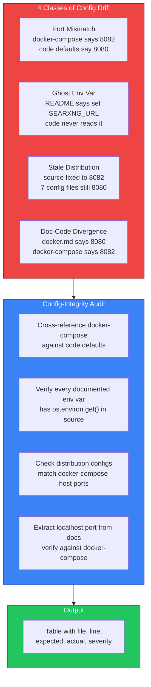

# LinkedIn Post — Config-Integrity Skill

## Post Content

My MCP servers crashed every restart. 13 orphaned node processes held ports hostage. Took 3 hours to find out why.

Turns out I had 4 different config drift bugs layered on top of each other.

**Bug 1: Port mismatch.** Docker-compose mapped port 8082 for SearXNG. But 12 source files still defaulted to 8080. Every search call hit a dead Swagger UI service instead of SearXNG.

**Bug 2: Ghost env var.** The README said "set SEARXNG_URL to override the default." The code never read that env var. Users who followed the docs got zero effect.

**Bug 3: Stale distribution configs.** 7 MCP config files in the distribution folder still pointed to the old port. I fixed the source code, forgot the configs.

**Bug 4: Doc-code divergence.** The docker.md said "SearXNG starts at localhost:8080." The docker-compose.yml said 8082. Both were "correct" depending on which file you believed.

I built a config-integrity skill that catches all 4 classes. It cross-references docker-compose.yml against code defaults, distribution configs, documentation, and the port registry. Every mismatch gets flagged with file, line, expected value, actual value, and severity.

The skill runs before any config-adjacent commit. Catches drift at the source.

Available in the skills_arsenal collection: github.com/Im-Busy/skills_arsenal

Config drift is the silent killer of infrastructure. One file says 8080, another says 8082, and your server crashes with EADDRINUSE. The skill makes these contradictions visible before they hit production.

---

## Suggested Visual

**Option A: Mermaid diagram** — Render this as an image via mermaid.ink:

**Option B: Screenshot** — Capture the PORT-REGISTRY.md ASCII port map showing the before/after of the audit.

**Option C: Terminal screenshot** — Show the `start-mcp-clean.ps1` script output killing 13 orphans and starting all 14 MCP services clean.

**Recommendation:** Option A (Mermaid diagram). It's self-contained, renders as an image on any platform, and shows the 4 bug classes + audit process at a glance. The red/blue/green color coding makes the story immediate.
