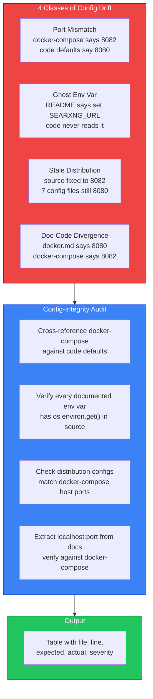

# LinkedIn Post — Config-Integrity Skill

## Post Content

Can a solo developer prevent all configuration drift bugs with a single skill?

That question pushed me into one of the most frustrating debugging sessions I've had in months.

For the last few weeks, I've been building a unified MCP (Model Context Protocol) infrastructure — 14 services, Docker containers, process orchestration, the whole stack. Everything worked until I restarted. Then everything broke.

Before writing a single line of code to fix it, I spent hours trying to understand why my servers kept crashing on restart. Not because the code was wrong, but because the configuration was wrong — in 4 different places, all at once.

The biggest challenge wasn't debugging.
It was understanding that config drift is invisible until it explodes.

Every feature introduced a new configuration surface. Docker-compose files, source code defaults, distribution configs, documentation — each one could drift from the others. Some bugs were obvious (EADDRINUSE). Some were silent (env vars documented but never read). Some were contradictory (docker.md said port 8080, docker-compose said 8082).

Packaging the skill for reuse, documenting the 4 bug classes, making it work across any project — that ended up taking almost as much effort as finding the bugs themselves.

The result is config-integrity, a skill that catches all 4 classes of configuration drift:

✅ Port Mismatch — docker-compose vs code defaults
✅ Ghost Env Vars — documented but never implemented
✅ Stale Distribution Configs — source fixed, configs forgot
✅ Doc-Code Divergence — docs say one thing, code says another

This project taught me that writing code is only one part of engineering.
Configuration, documentation, and consistency are equally important.
A single file saying 8080 while another says 8082 can crash your entire infrastructure.

This is only Version 1.
I'm excited to continue improving it and learning more about preventing config drift at scale.

If you've dealt with configuration drift in your own projects, I'd genuinely love to hear your stories in the comments. What bugs have you found? How did you fix them? I'm interested in patterns I haven't thought of yet.

Feedback is always welcome.

Available in the skills_arsenal collection: github.com/Im-Busy/skills_arsenal

#config #infrastructure #devops #automation #python #mcp #skills #engineering

---

## Suggested Visual

**Option A: Mermaid diagram** — Render this as an image via mermaid.ink:

**Option B: Screenshot** — Capture the PORT-REGISTRY.md ASCII port map showing the before/after of the audit.

**Option C: Terminal screenshot** — Show the `start-mcp-clean.ps1` script output killing 13 orphans and starting all 14 MCP services clean.

**Recommendation:** Option A (Mermaid diagram). It's self-contained, renders as an image on any platform, and shows the 4 bug classes + audit process at a glance. The red/blue/green color coding makes the story immediate.
